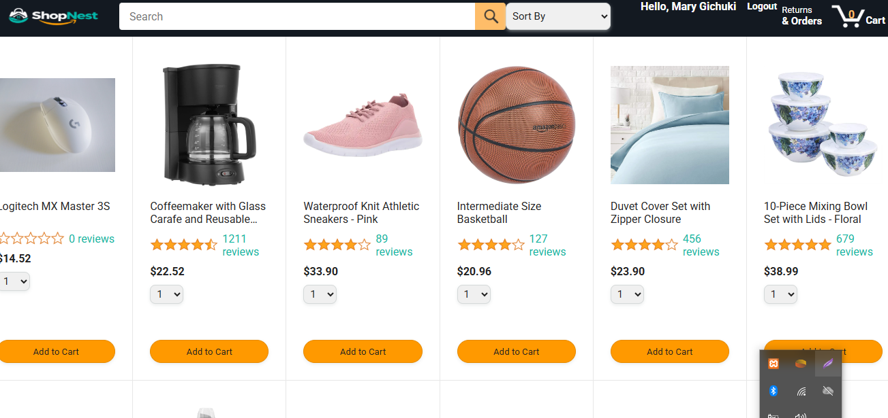
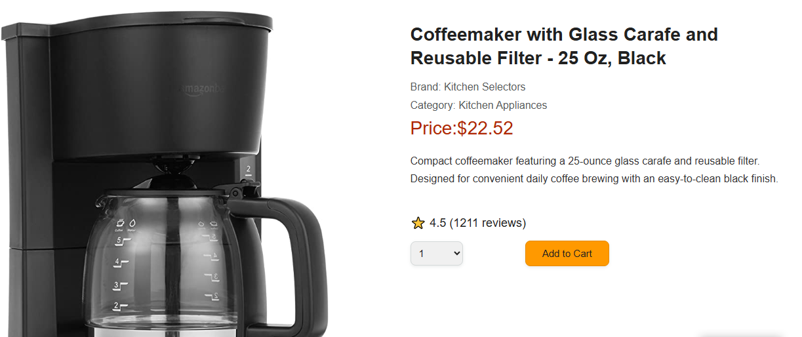
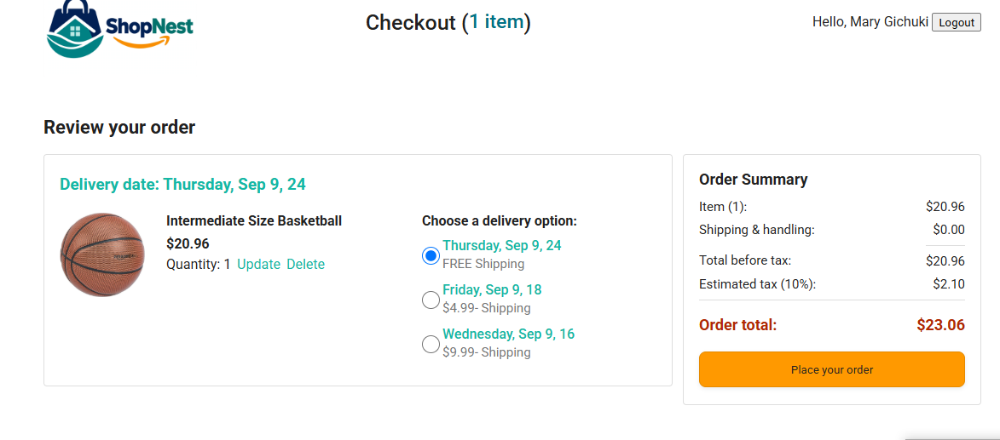
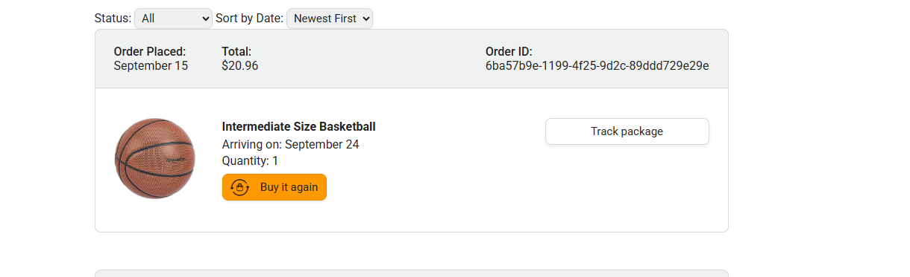
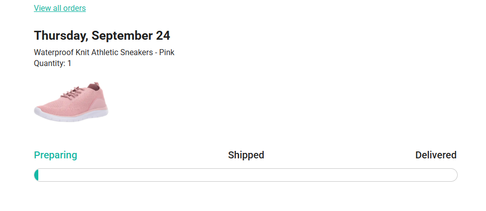
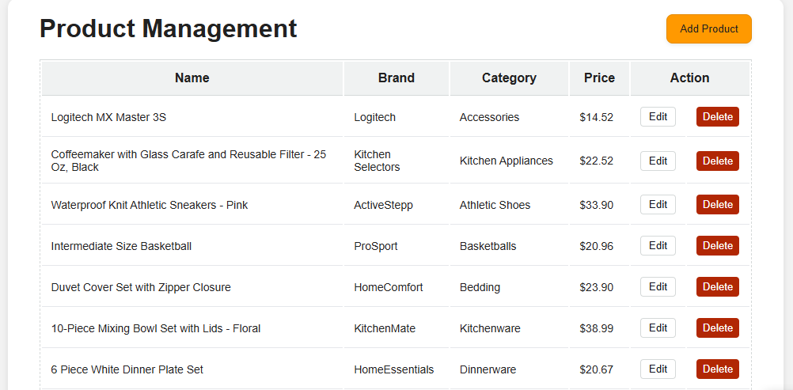
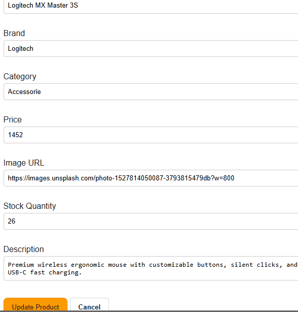

ShopNest 🛒

ShopNest is a full-stack e-commerce web application inspired by modern online shopping platforms. It allows customers to browse products, manage their cart, place orders, track orders, and manage their accounts.

The project also includes an admin dashboard for managing products and demonstrates a complete frontend-to-backend workflow using JavaScript, Node.js, Express.js, and MySQL.

Project Links
GitHub Repository
Features
Customer Features
Browse and search products
Sort products
View product details
Add products to the cart
Update product quantities
Remove products from the cart
Select delivery options
View order summary and payment summary
Place orders
View previous orders
Track orders
Register an account
Login and logout
Authentication using HTTP-only cookies
Responsive user interface
Customer and admin role-based access
Admin Features
Admin dashboard
View products
Add new products
Edit existing products
Delete products
Manage product information
Role-based admin access
Protected admin routes
Tech Stack
Frontend
HTML5
CSS3
JavaScript (ES6+)
Fetch API
Responsive Design
Backend
Node.js
Express.js
REST API
JWT Authentication
HTTP-only Cookies
Joi Validation
bcrypt
CORS
Morgan
Database
MySQL / MariaDB
phpMyAdmin
Development Tools
Git
GitHub
Visual Studio Code
XAMPP
Jasmine
Project Structure
ShopNest/
├── API/
├── backend/
│   ├── config/
│   ├── controller/
│   ├── data/
│   ├── middleware/
│   ├── router/
│   ├── spec/
│   ├── utils/
│   └── validator/
├── images/
├── screenshots/
├── scripts/
├── styles/
├── test.jasmine/
├── .gitignore
├── admin.html
├── checkout.html
├── index.html
├── login.html
├── orders.html
├── product-detail.html
├── register.html
├── tracking.html
└── README.md
Getting Started
Prerequisites

Before running ShopNest locally, make sure you have installed:

Node.js
npm
MySQL or MariaDB
XAMPP (if using the XAMPP MySQL/MariaDB server)
Git
Visual Studio Code or another code editor
1. Clone the Repository
git clone https://github.com/22-mary/ShopNest.git
cd ShopNest
2. Set Up the Backend

Navigate to the backend folder:

cd backend

Install the backend dependencies:

npm install

Create a .env file inside the backend folder.

Example:

PORT=8000

DB_HOST=localhost
DB_USER=root
DB_PASSWORD=
DB_NAME=shopnest

JWT_SECRET=your_secret_key

Do not commit your .env file to GitHub. It is excluded using .gitignore.

3. Set Up the Database

Start MySQL/MariaDB using XAMPP or your preferred database server.

Create a database named:

shopnest

Import the ShopNest database structure and data into the shopnest database using phpMyAdmin or another MySQL client.

The database contains tables for:

Users
Products
Cart
Orders
Order Items
Delivery Options

Make sure the database credentials in the backend .env file match your local MySQL configuration.

4. Start the Backend

From the backend folder, run:

npm run dev

The backend API will run at:

http://localhost:8000

The API base URL is:

http://localhost:8000/api
5. Start the Frontend

Open the project in Visual Studio Code and use the Live Server extension to start the frontend.

The frontend will typically run at:

http://localhost:5501

Open:

http://localhost:5501/index.html
Testing

ShopNest includes Jasmine tests for both the frontend and backend.

Backend Tests

Navigate to the backend folder:

cd backend

Run:

npm test

The backend tests cover areas such as:

Authentication validation
Registration validation
Product operations
Order creation
Backend API behavior
Error handling
Frontend Tests

The project includes Jasmine tests for frontend functionality.

The frontend tests cover areas such as:

Product loading
Product details
Cart functionality
Adding products to the cart
Order placement
API error handling
Customer/admin behavior
Screenshots
Products

Product Details

Checkout

Orders

Order Tracking

Admin Dashboard

Admin Edit Product

Authentication

ShopNest uses JWT-based authentication with HTTP-only cookies.

The authentication flow includes:

User registration
User login
Authentication state checking
Logout
Protected routes
Role-based access control
Customer and admin roles

Authentication tokens are stored in HTTP-only cookies rather than browser local storage.

Admin functionality is protected so that regular customers cannot access the admin dashboard.

API

The backend provides REST API endpoints for the application's main functionality.

The API includes functionality for:

Authentication
Users
Products
Cart
Orders
Delivery options
Admin product management

The local API base URL is:

http://localhost:8000/api
Future Improvements

Possible future improvements include:

Deploy the frontend and backend
Use a hosted MySQL database
Add online payment integration
Add product reviews and ratings
Add pagination
Add advanced product filtering
Improve image management
Add email notifications
Improve automated test coverage
Add production environment configuration
Improve accessibility
Add additional security and validation measures
Author

Mary Gichuki

GitHub: [22-mary](https://github.com/22-mary)

License

This project is licensed under the MIT License.